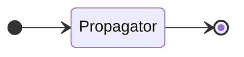
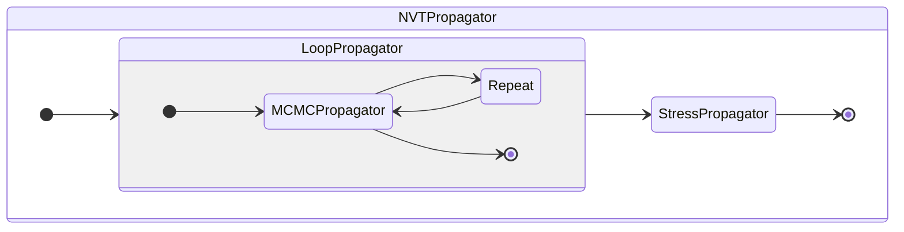
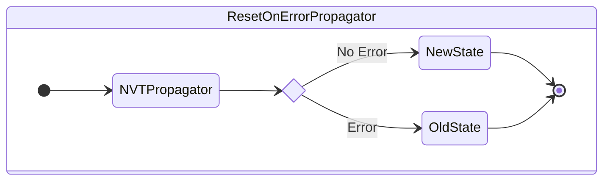
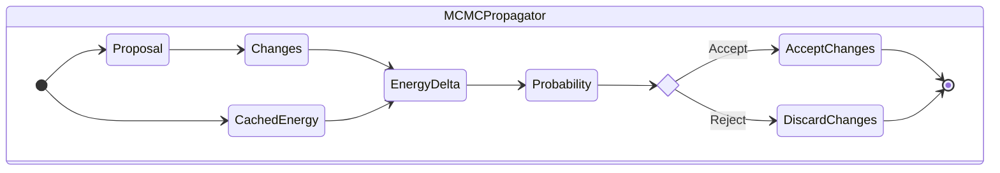

# 🏗️ Architecture & Design

### State Propagation Pattern
*k*UPS employs a functional programming approach where simulations are built by composing state propagators. Each propagator transforms the system state deterministically or stochastically:


**Key principles:**

- **Markovian**: Each propagator depends only on the current state
- **Pure functions**: No side effects, ensuring reproducibility
- **Composable**: Complex simulations built from simple building blocks

### Example: NVT Simulation Flow
An NVT simulation demonstrates the composable architecture:

This design efficiently batches expensive operations (like stress calculation) while maintaining sampling quality through frequent MCMC moves.

### Benefits of Composability
This architecture delivers several advantages:

- **🔄 Reusable Components**: Propagators work across different simulation types
- **📦 Stateful Design**: All information lives in the current state object
- **🛠️ Error Handling**: Natural error recovery through state rollback
- **🎯 Flexible Workflows**: Mix and match components for custom simulations

**Example - Automatic Error Recovery:**


### Monte Carlo Move Mechanics
Each Monte Carlo step follows a structured three-phase process:

1. **🎲 Proposal**: Generate a trial configuration change
2. **⚡ Energy Evaluation**: Calculate energy difference efficiently
3. **✅ Accept/Reject**: Apply Metropolis criterion for move acceptance



### Lens Pattern for State Management
Since *k*UPS uses a generic `State` object that can contain different types of information depending on the simulation, we employ the **lens pattern** for safe and composable state modifications. Lenses provide a functional way to focus on, access, and update specific parts of nested data structures.

**Key Benefits:**

- **🔍 Focused Access**: Target specific parts of complex state objects
- **🛡️ Type Safety**: Compile-time guarantees for state modifications
- **🔄 Immutability**: Create new state versions without side effects
- **🧩 Composability**: Combine lenses to access deeply nested data

**Example Usage:**
```python
from jax import Array
from kups.core.lens import lens
from kups.core.utils.jax import dataclass

@dataclass
class MyState:
    energy: Array

# Create an energy lens
energy_lens = lens(lambda state: state.energy, cls=MyState)
# Access energy through a lens
current_energy = energy_lens.get(state)
# Update energy immutably
new_state = energy_lens.set(state, updated_energy)
```

This approach ensures that different propagators can safely modify their relevant parts of the state while maintaining the overall system integrity and enabling powerful composition patterns.

**Learn more:**

- [Lens pattern documentation](lens.md)
- [`kups.core.lens` API Reference](reference/kups/core/lens.md)

