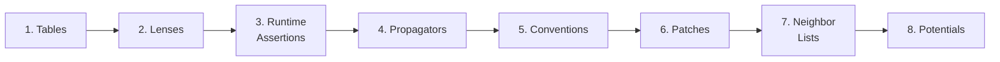

# Handbook

The handbook works through the primitives <em>k</em>UPS is built from, one chapter per primitive. Each chapter covers what the primitive is, what forced it into the design, and what the next chapter will assume.

It is not an API reference. Function signatures live under the API Reference tab, and CLI-ready packaged simulations under [Simulations](simulations.md). Code samples assume familiarity with [JAX pytrees](https://docs.jax.dev/en/latest/pytrees.html) and [`jax.jit`](https://docs.jax.dev/en/latest/_autosummary/jax.jit.html). They follow the unit system described in [Units](units.md).

<em>k</em>UPS is a toolkit for batched, differentiable molecular simulations on GPU. A single composable interface covers molecular dynamics, Monte Carlo, geometry optimization, classical force fields, and machine-learning potentials (via [Tojax](https://github.com/cusp-ai-oss/tojax)), and it is designed so that thousands of independent systems run in parallel as a single vectorized computation.

## Three requirements that usually fight

A molecular-simulation framework has to satisfy three things at once, and the naive solution to each breaks the other two.

- **Hardware throughput.** Force evaluations dominate cost, and a real workflow needs thousands of independent simulations running on a single GPU at once. Structure-of-arrays layout with coalesced access across threads is the only thing that saturates the hardware; a Python object per particle will not compile, and a loop that holds one system at a time leaves the GPU idle.
- **Composability.** Real research mixes MD with MC, custom potentials, online analysis, and new ensembles. A monolithic simulator per ensemble would require a fork per method.
- **Per-step latency.** Step N+1 reads step N's state, so a simulation is sequential by construction and per-step latency sets the wall-clock cost. Compiling the whole step into a single fixed-shape [`jax.jit`](https://docs.jax.dev/en/latest/_autosummary/jax.jit.html) kernel brings it down to what classical C++ engines deliver; a Python-interpreted loop does not. Fixed-shape is the price.

<em>k</em>UPS resolves the three together through a small set of composable primitives. The chapters below cover them in order.

## The chain



1. **[Tables](notebooks/tables.md).** Keyed containers and typed foreign-key indices. Flat arrays compile to a single kernel but lose the relational structure that tells you which particle belongs to which system; [`Table`](reference/kups/core/data/table.md#kups.core.data.table.Table) and [`Index`](reference/kups/core/data/index_py.md#kups.core.data.index.Index) put that structure back at compile time. [`Table.union`](reference/kups/core/data/table.md#kups.core.data.table.Table.union) flattens many independent systems into one vectorized computation, the basis for the batched chains that appear in every later chapter. [`Buffered`](reference/kups/core/data/buffered.md#kups.core.data.buffered.Buffered) pre-allocates free slots inside a fixed-capacity array so GCMC can insert and delete without recompiling.

2. **[Lenses](notebooks/lens.md).** Get-and-update pairs. Tables fix the shape of the data, but each primitive still has to work against user-defined state layouts. Lenses let generic code read and write specific fields without reaching into the layout.

3. **[Runtime Assertions](notebooks/runtime_assertions.md).** Side-channel checks that survive JIT. Buffer sizes cannot always be known in advance; [`runtime_assert`](reference/kups/core/assertion.md#kups.core.assertion.runtime_assert) fails cleanly from inside a compiled kernel, and the host-side retry loop [`propagate_and_fix`](reference/kups/core/propagator.md#kups.core.propagator.propagate_and_fix) resizes the buffer and re-enters.

4. **[Propagators](notebooks/propagators.md).** The evolution primitive, `(key, state) → state`. MD integrators, MC moves, neighbor-list refreshes, and logging steps all share this signature. A full MD step is a sequential composition of momentum, position, and potential primitives.

5. **[Conventions](notebooks/conventions.md).** `Has*` and `Is*` protocols, plain dataclasses, `make_*_from_state` factories, and `@property` for derived quantities. There is no framework base class; a state satisfies the protocols it needs structurally, and carries only the fields it uses.

6. **[Patches](notebooks/patches.md).** Conditional local state changes: "if accepted, write these bytes here." Patches make incremental Monte Carlo possible. Build the patch, score it, accept or reject, and commit the change together with its cache dependencies atomically. Each batched chain decides independently.

7. **[Neighbor Lists](notebooks/neighborlist.md).** Which particle pairs sit within `r_cut`. Naive search is O(N²) and also breaks the fixed-shape contract. The neighbor-list layer hides cell lists, refinement, capacity growth, and incremental updates behind a single protocol.

8. **[Potentials](notebooks/potentials.md).** Energy as a composable, differentiable object. Potentials compose by summation: classical terms (LJ + Coulomb + bonded) and ML force fields imported through [Tojax](https://github.com/cusp-ai-oss/tojax). Propagators compose by sequencing. [`CachedPotential`](reference/kups/core/potential.md#kups.core.potential.CachedPotential) stores the last full evaluation; when it sees a patch, it only evaluates the delta. This is what makes a production-sized Metropolis-Hastings step cheap.

MD, MC, relaxation, batched GCMC, and ML-potential dynamics are all assembled from these pieces.

## A worked example: `md_lj`

The simulation in [`kups.application.simulations.md_lj`](reference/kups/application/simulations/md_lj.md#kups.application.simulations.md_lj) (CLI: `kups_md_lj`) is the shortest complete one in the repo. The file is about a hundred lines; the `run` function is ten of them. The four blocks below trace it through the chain.

**State definition.** The user picks the fields; nothing inherits from a framework base.

```python
@dataclass
class LjMdState:
    particles: Table[ParticleId, MDParticles]
    systems: Table[SystemId, MDSystems]
    neighborlist_params: UniversalNeighborlistParameters
    step: Array
    lj_parameters: LennardJonesParameters
```

The state structurally satisfies `IsMdState` (ch. 5). Both tables carry relational data via typed foreign-key indices (ch. 1). `neighborlist_params` is resized by the retry loop on overflow (ch. 3, ch. 7), and `lj_parameters` holds the LJ parameters (ch. 8).

**State construction.** Read a standard file, build the two tables, pick initial capacities.

```python
particles, systems = md_state_from_ase(config.inp_file, config.md, key=mb_key)
neighborlist_params = UniversalNeighborlistParameters.estimate(
    particles.data.system.counts, systems, lj_params.cutoff
)
```

`md_state_from_ase` accepts xyz, cif, or lammps input. [`UniversalNeighborlistParameters.estimate`](reference/kups/core/neighborlist.md#kups.core.neighborlist.UniversalNeighborlistParameters.estimate) guesses initial capacities from geometry (ch. 7); it does not have to be exact, because warmup grows what is too small via the fix-and-retry loop (ch. 3).

**Wiring potential and propagator.** Factories take a single state lens and fan it out to the fields they need.

```python
state_lens = identity_lens(LjMdState)
potential = make_lennard_jones_from_state(
    state_lens, compute_position_and_unitcell_gradients=True
)
propagator = make_md_propagator(state_lens, config.md.integrator, potential)
```

[`make_lennard_jones_from_state`](reference/kups/potential/classical/lennard_jones.md#kups.potential.classical.lennard_jones.make_lennard_jones_from_state) reads particles, systems, and LJ parameters through the state lens (ch. 2, ch. 5). [`make_md_propagator`](reference/kups/application/md/simulation.md#kups.application.md.simulation.make_md_propagator) composes a [`PotentialAsPropagator`](reference/kups/core/potential.md#kups.core.potential.PotentialAsPropagator), the integrator's momentum and position steps, a step counter, and a [`ResetOnErrorPropagator`](reference/kups/core/propagator.md#kups.core.propagator.ResetOnErrorPropagator) inside one [`SequentialPropagator`](reference/kups/core/propagator.md#kups.core.propagator.SequentialPropagator) (ch. 4).

**Running.** The loop lives on the host side.

```python
state = run_md(next(chain), propagator, state, config.run)
```

`run_md` has two phases. Warmup calls [`propagate_and_fix`](reference/kups/core/propagator.md#kups.core.propagator.propagate_and_fix) until buffer capacities stabilize (ch. 3). Production runs the compiled propagator with an HDF5 logger and a progress bar. Each step is one JIT call, and [buffer donation](https://docs.jax.dev/en/latest/faq.html#buffer-donation) lets JAX reuse the input state's memory for the output so the step allocates nothing new.

## Where to go next

Run a packaged simulation from [Simulations](simulations.md) and trace it back through the chapters. [Troubleshooting](troubleshooting.md) covers the GPU and JIT errors that come up most often.
