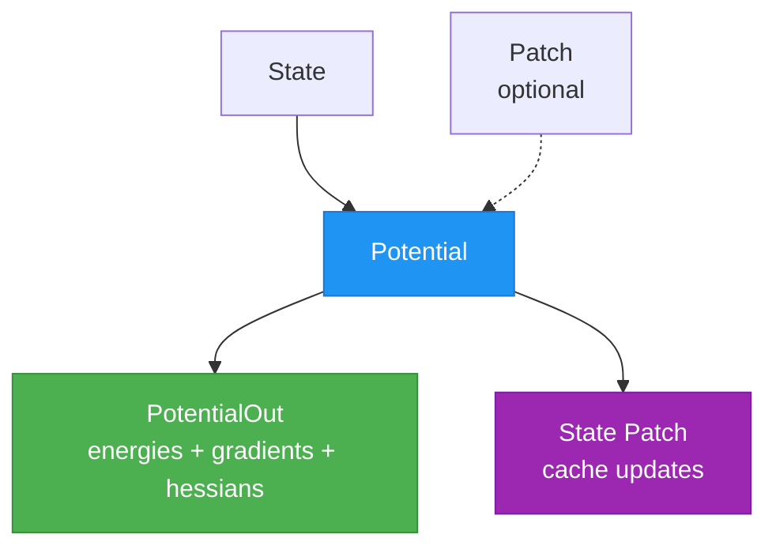
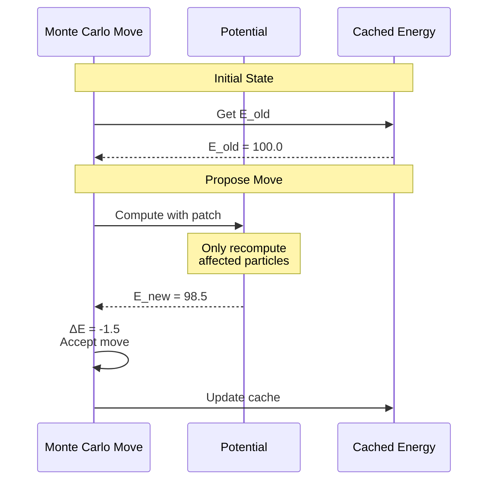
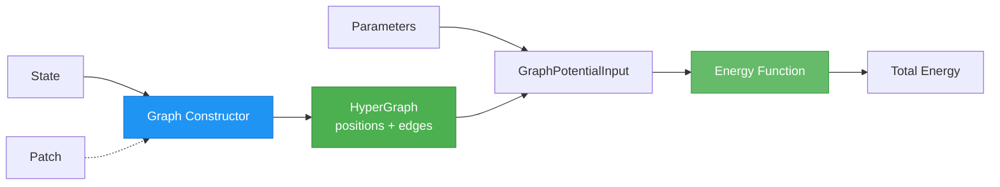
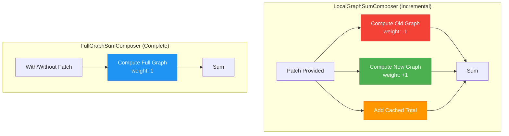
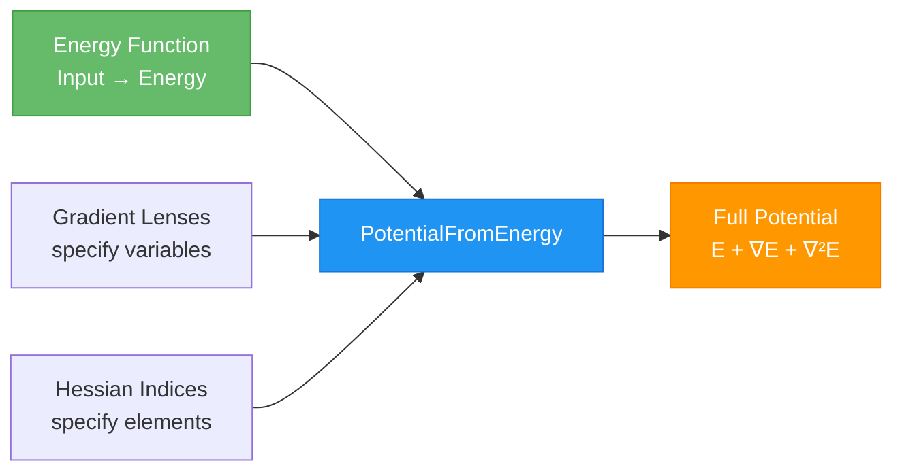
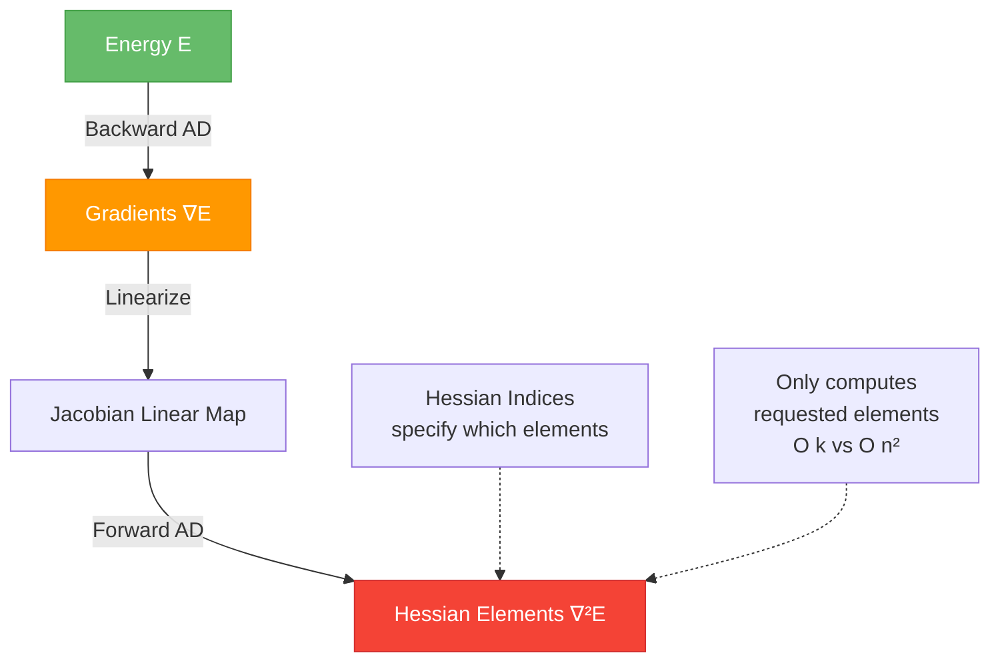
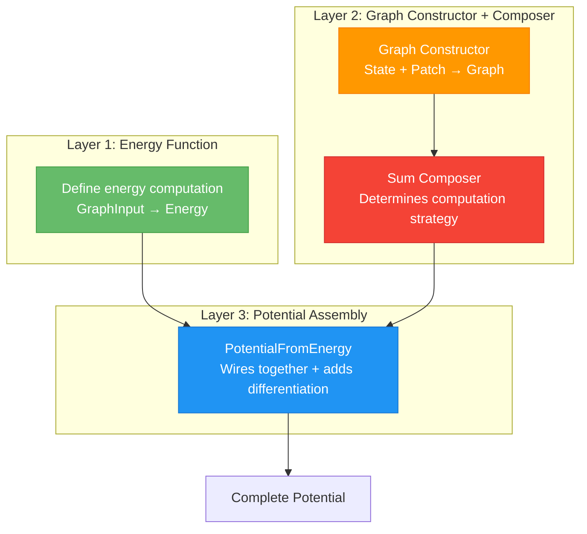
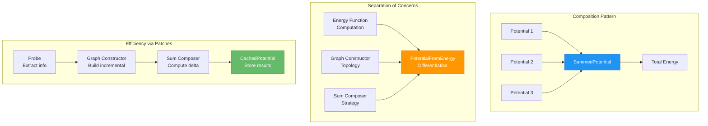

# Potential Energy Design

*k*UPS potentials compute energies, gradients, and Hessians through a composable, differentiable architecture. The design enables efficient incremental updates for Monte Carlo simulations and automatic derivative computation via JAX.



## Core Abstractions

### PotentialOut
[`PotentialOut`](reference/kups/core/potential.md#kups.core.potential.PotentialOut) contains energy and derivatives for a system:

```python
out = PotentialOut(
    total_energies=jnp.array([10.5, 12.3]),  # shape (n_systems,)
    gradients={"positions": forces},          # arbitrary PyTree structure
    hessians=Empty()                          # Empty() if not computed
)
```

**Linearity assumption**: Energies, gradients, and Hessians can be summed, enabling composition via [`SummedPotential`](reference/kups/core/potential.md#kups.core.potential.SummedPotential):

```python
# Compose force field components
total = sum_potentials(
    lennard_jones_potential,
    coulomb_potential,
    harmonic_bond_potential
)
```

### Potential Protocol
[`Potential`](reference/kups/core/potential.md#kups.core.potential.Potential) defines the interface for energy computation:

```python
def __call__(
    self, state: State, patch: Patch | None = None
) -> WithPatch[PotentialOut[Gradients, Hessians], Patch[State]]:
    ...
```

The `patch` argument enables **efficient incremental updates**. Rather than recomputing the entire potential, implementations can:
- Compute energy only for changed particles (Monte Carlo moves)
- Reuse cached neighbor lists
- Update only affected interactions

## Implementation Approaches

There are two ways to implement the [`Potential`](reference/kups/core/potential.md#kups.core.potential.Potential) protocol:

1. **Energy-based with automatic differentiation** (recommended): Implement a simple energy function and let [`PotentialFromEnergy`](reference/kups/potential/common/energy.md#kups.potential.common.energy.PotentialFromEnergy) handle gradients and Hessians automatically. This is covered in detail below.

2. **Direct implementation**: Implement the `Potential` protocol directly, computing energies, gradients, and Hessians manually. Use this for specialized cases where automatic differentiation isn't suitable or when you need explicit control over derivative computation.

Most potentials use the energy-based approach with automatic differentiation, which we describe in the following sections.

## Efficient Updates with Patches

### The Patch Mechanism
A [`Patch`](reference/kups/core/patch.md#kups.core.patch.Patch) describes state modifications since the last evaluation. Potentials use patches to compute energy differences efficiently:



```python
# Monte Carlo step: compute ΔE instead of E_total
result = potential(state, patch=move_patch)

# Energy difference from cached value
delta_E = result.out.total_energies - cached_potential.cached_value(state).total_energies
```

### CachedPotential
[`CachedPotential`](reference/kups/core/potential.md#kups.core.potential.CachedPotential) wraps potentials to cache outputs and update via patches:

```python
cached_lj = CachedPotential(
    potential=lj_potential,
    cache=lens(lambda s: s.lj_cache),          # where to store cache
    patch_idx_view=lambda s: s.particle_indices # indexing for updates
)

# First call: compute and cache
result = cached_lj(state, patch=None)
state = result.patch(state, accept_mask)

# Access cached value
previous_energy = cached_lj.cached_value(state)
```

The `patch_idx_view` provides the indexing structure matching the potential output, used to selectively update cached values based on acceptance masks.

## Graph-Based Potentials

Most potentials operate on **graph representations** of molecular systems. The graph abstraction separates topology construction from energy computation, enabling efficient updates when only positions change.



### HyperGraph Structure

A [`HyperGraph`](reference/kups/potential/common/graph.md#kups.potential.common.graph.HyperGraph) represents the molecular topology with positions, edges, and batch information. The generic `Degree` parameter specifies interaction order: `2` for pairwise (Lennard-Jones, Coulomb), `3` for angles, `4` for dihedrals, etc.

### Graph Constructors

A [`GraphConstructor`](reference/kups/potential/common/graph.md#kups.potential.common.graph.GraphConstructor) builds the graph representation from the simulation state. Different constructors handle different topologies:

**Constructor implementations**:

- **[`RadiusGraphConstructor`](reference/kups/potential/common/graph.md#kups.potential.common.graph.RadiusGraphConstructor)**: Builds edges dynamically based on distance cutoff (e.g., Lennard-Jones, Coulomb). Uses neighbor lists for efficiency.
- **[`EdgeSetGraphConstructor`](reference/kups/potential/common/graph.md#kups.potential.common.graph.EdgeSetGraphConstructor)**: Uses fixed bond/angle topology (e.g., harmonic bonds). Edges don't change, only positions.
- **[`PointCloudConstructor`](reference/kups/potential/common/graph.md#kups.potential.common.graph.PointCloudConstructor)**: No edges, just positions and species (e.g., external fields).

The `old_graph` parameter is key for Monte Carlo efficiency. When `True`, the constructor returns the graph representing the state **before** applying the patch. This enables computing energy differences by evaluating both old and new configurations.

### Sum Composers

A [`SumComposer`](reference/kups/potential/common/energy.md#kups.potential.common.energy.SumComposer) determines which configurations to compute based on patches. This is key to efficient Monte Carlo sampling:



**Composer strategies**:

- **[`LocalGraphSumComposer`](reference/kups/potential/common/graph.md#kups.potential.common.graph.LocalGraphSumComposer)**: Computes energy difference via `E_cached - E_old + E_new`. When a patch is provided, it:
    1. Builds the old graph (before changes) with weight -1
    2. Builds the new graph (after changes) with weight +1
    3. Includes the previously cached total energy

    Result: Only affected interactions are recomputed, not the entire system.

- **[`FullGraphSumComposer`](reference/kups/potential/common/graph.md#kups.potential.common.graph.FullGraphSumComposer)**: Always computes full system energy. Used for global corrections (e.g., Ewald long-range terms, tail corrections) where incremental computation isn't beneficial.

The incremental strategy is essential for Monte Carlo efficiency - moving a single particle only recomputes energies involving that particle, not all N² pairwise interactions.

## Automatic Differentiation

The automatic differentiation system transforms a simple energy function into a full potential with gradients and Hessians:



### PotentialFromEnergy

[`PotentialFromEnergy`](reference/kups/potential/common/energy.md#kups.potential.common.energy.PotentialFromEnergy) wraps an energy function and adds automatic differentiation for gradients and Hessians.

The key parameters are:

- `energy_fn`: Your energy function (Input → Energy)
- `composer`: Determines which configurations to compute based on patches
- `gradient_lens`: Focuses on the variables to differentiate (e.g., positions)
- `hessian_lens`: Selects subset of gradients for second derivatives
- `hessian_idx_view`: Specifies which Hessian elements to compute
- `cache_lens` / `patch_idx_view`: Optional caching for Monte Carlo efficiency

### Gradient Computation
Gradients are computed via **reverse-mode automatic differentiation** (vector-Jacobian product). Internally, the system:

1. Extracts the variables to differentiate using `gradient_lens`
2. Wraps the energy function to accept these variables as input
3. Applies reverse-mode differentiation to compute all gradients in a single backward pass
4. Returns gradients in the same structure as the input variables

This approach is efficient regardless of dimensionality - computing ∇E with respect to 1000 positions costs the same as computing it for 10 positions (roughly 2-3× the forward pass cost).

### Hessian Computation
Hessians use **forward-on-backward differentiation** for efficiency. Rather than computing the full Hessian matrix (which scales as O(n²) for n variables), *k*UPS computes only the specified elements:



The computation process:

1. **Backward pass**: Compute gradient function ∇E via reverse-mode AD
2. **Linearization**: Create a linear approximation of the gradient function (Jacobian map)
3. **Forward pass**: Apply forward-mode AD to the linearized gradient with tangent vectors
4. **Selection**: Extract only the requested Hessian elements specified by `hessian_idx_view`

The `hessian_idx_view` returns index pairs `[row_indices, col_indices]` specifying which Hessian elements ∂²E/∂xᵢ∂xⱼ to compute. The outer dimension enables vectorized parallel computation:

```python
# Example: Compute 3×3 Hessian block for first three variables
# Each sub-array computes one row in a single forward pass
hessian_indices = [
    [[0, 0, 0], [0, 1, 2]],  # Row 0: ∂²E/∂x₀∂xⱼ for j=0,1,2
    [[1, 1, 1], [0, 1, 2]],  # Row 1: ∂²E/∂x₁∂xⱼ for j=0,1,2
    [[2, 2, 2], [0, 1, 2]],  # Row 2: ∂²E/∂x₂∂xⱼ for j=0,1,2
]
# Cost: 3 forward passes (one per row) instead of 9 individual elements
```

This sparse computation is essential for large systems where you only need selected Hessian elements (e.g., for specific atom pairs or normal mode analysis).

## Implementing a Potential

The potential implementation follows a three-layer architecture:



### 1. Define Energy Function
Write a function computing scalar energy from graph input:

```python
def my_energy(inp: GraphPotentialInput[MyParams, Literal[2], Any]) -> WithPatch[Energy, Patch]:
    graph = inp.graph
    params = inp.parameters

    # Compute per-edge energies
    edge_energy = compute_edge_contribution(graph, params)

    # Sum over edges per system
    total_energies = jax.ops.segment_sum(
        edge_energy,
        graph.edge_batch_mask,
        graph.batch_size
    )

    return WithPatch(total_energies, IdPatch())
```

### 2. Construct the Potential
Combine the energy function with graph constructor, composer, and lenses to create a complete differentiable potential. See [`make_lennard_jones_potential`](reference/kups/potential/classical/lennard_jones.md#kups.potential.classical.lennard_jones.make_lennard_jones_potential) for a complete reference implementation.

The construction pattern:

1. **Create graph constructor** - Specifies how to build topology from state and patches
2. **Create sum composer** - Determines incremental vs full computation strategy
3. **Assemble with PotentialFromEnergy** - Wires components together with automatic differentiation

Key parameters to provide:

- `particles_view`: Extracts particle data (positions, species/charges) with segmentation from state
- `unitcell_view`: Extracts unit cell parameters from state
- `neighborlist_view`: Extracts neighbor list from state (for radius-based potentials)
- `parameter_view`: Extracts potential parameters from state (σ, ε, charges, etc.)
- `probe_particles`: Detects particle changes for incremental updates
- `probe_neighborlist_new`: Provides updated neighbor list with new particle positions
- `probe_neighborlist_old`: Provides neighbor list with old particle positions
- `gradient_lens`: Focuses on variables to differentiate (typically positions)
- `hessian_lens`: Selects subset of gradients for Hessian computation
- `hessian_idx_view`: Specifies which Hessian elements to compute
- `patch_idx_view`: Provides indexing structure for cache updates (matches output structure)
- `out_cache_lens`: Specifies where to store cached results in state

### 3. Use in Simulation
Once constructed, potentials can be composed and used in simulations:

```python
# Compose multiple potentials
total_potential = sum_potentials(
    lennard_jones_potential,
    coulomb_potential,
    harmonic_bond_potential,
)

# Full evaluation (e.g., initial energy)
result = total_potential(state, patch=None)
energies = result.out.total_energies          # Shape: (n_systems,)
forces = -result.out.gradients["positions"]   # Negative gradient gives force

# Incremental update for Monte Carlo
result = total_potential(state, patch=move_patch)
new_energy = result.out.total_energies
old_energy = cached_potential.cached_value(state).total_energies
delta_E = new_energy - old_energy             # Energy difference for accept/reject
```

## Built-in Potentials

*k*UPS provides several classical potentials in [`kups.potential.classical`](reference/kups/potential/classical/index.md):

### Lennard-Jones
Van der Waals interactions via 12-6 potential with support for:

- **Standard form**: [`make_lennard_jones_potential`](reference/kups/potential/classical/lennard_jones.md#kups.potential.classical.lennard_jones.make_lennard_jones_potential)
- **Lorentz-Berthelot mixing**: Automatic combining rules for unlike species
- **Pair-wise tail corrections**: [`make_pair_tail_corrected_lennard_jones_potential`](reference/kups/potential/classical/lennard_jones.md#kups.potential.classical.lennard_jones.make_pair_tail_corrected_lennard_jones_potential) - smooth switching function
- **Global analytical corrections**: [`make_global_lennard_jones_tail_correction_potential`](reference/kups/potential/classical/lennard_jones.md#kups.potential.classical.lennard_jones.make_global_lennard_jones_tail_correction_potential) - mean-field correction for truncated potential

### Coulomb
Electrostatic interactions:

- **Vacuum**: [`make_coulomb_vacuum_potential`](reference/kups/potential/classical/coulomb.md#kups.potential.classical.coulomb.make_coulomb_vacuum_potential) - direct Coulomb summation
- **Periodic (Ewald)**: [`kups.potential.classical.ewald`](reference/kups/potential/classical/ewald.md) - reciprocal space summation for periodic boundaries

### Bonded Interactions
Fixed topology potentials for molecular structures:

- **Harmonic bonds**: [`make_harmonic_bond_potential`](reference/kups/potential/classical/harmonic.md#kups.potential.classical.harmonic.make_harmonic_bond_potential) - quadratic distance restraints
- **Harmonic angles**: [`make_harmonic_angle_potential`](reference/kups/potential/classical/harmonic.md#kups.potential.classical.harmonic.make_harmonic_angle_potential) - quadratic angle restraints

All potentials follow the same construction pattern and can be freely composed via [`sum_potentials`](reference/kups/core/potential.md#kups.core.potential.sum_potentials).

## Design Patterns Summary



**Composition over inheritance**: Potentials are composed via [`SummedPotential`](reference/kups/core/potential.md#kups.core.potential.SummedPotential) rather than class hierarchies. This allows mixing and matching force field components freely.

**Separation of concerns**:
- Energy functions compute scalar energies (physics)
- Graph constructors handle topology (structure)
- Sum composers determine computation strategy (efficiency)
- [`PotentialFromEnergy`](reference/kups/potential/common/energy.md#kups.potential.common.energy.PotentialFromEnergy) wires everything together with automatic differentiation

**Efficiency through patches**:
- [`Probe`](reference/kups/core/patch.md#kups.core.patch.Probe) extracts relevant information from patches
- Graph constructors use patches to build incremental topologies (old vs new)
- Sum composers use patches to compute energy differences (delta-E instead of total E)
- [`CachedPotential`](reference/kups/core/potential.md#kups.core.potential.CachedPotential) stores results for comparison

**Type safety with generics**: Type parameters ensure consistency between state, patches, gradients, and Hessians at compile time.

## See Also

- [Lenses](lens.md) for state management patterns
- [Architecture](architecture.md) for propagator composition
- [Assertions](assertions.md) for capacity management in dynamic graphs
